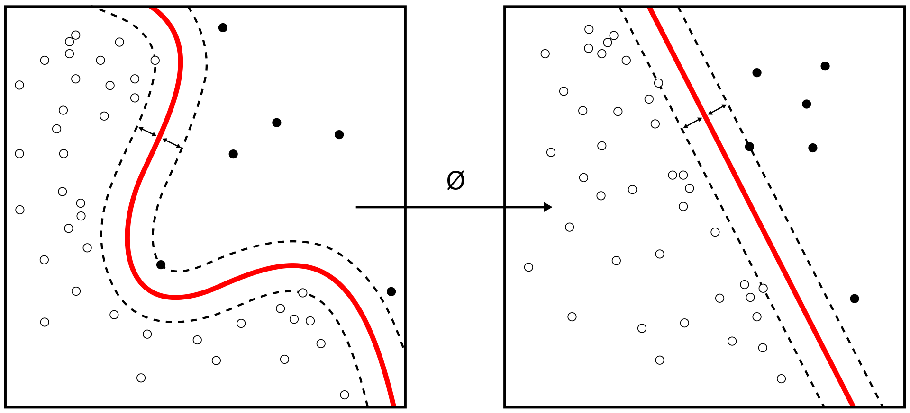

Install Anaconda Python 3.6 version
https://conda.io/docs/user-guide/install/index.html

Install Python 3.6
https://www.python.org/downloads/release/python-360/

Install Jupyter Notebook
https://jupyter.org/install 

# COVID-19 Diagnosis with Neural-Networks

## Abstract

First identified in 2019 in Wuhan, China, COVID-19 is an infectious disease caused by severe acute respiratory syndrome. The disease can cause a range of breathing problems, from mild to critical. While 80% of the infected are asymptomatic, older adults and people with pre-existing health conditions like diabetes, kidney, lung, or heart disease may have more serious symptoms. 
The novel coronavirus can infect the upper or lower part of the respiratory tract and sometimes can reach all the way down into the alveoli (when people develop pneumonia). These signs of respiratory inflammation can be analysed by doctors by performing a chest Xray or CT scan. For an infected individual, a chest CT, might seem like “ground-glass opacity” because it looks like frosted glass on a shower door.

## Problem Statement & Proposed Solution

Chest X-Ray (CXR) is the globally accepted standard for performing preliminary investigations of pulmonary ailments in a non-invasive manner. The infected patients have displayed discrete trend of visual features in CXR images in all the preceding studies. Where current lab test (RT-PCR) results of nose and throat samples take nearly 24 hours, CXR can act as a speedy alternative screening mechanism for the detection of COVID-19 or to validate the related diagnosis. Development of an AI system for the development of Covid-19 in lungs could help in rapid screening of patients, aiding in speedy detection of the virus which could potentially protect several associated lives by enforcing an early isolation.
In the recent months various research around the world have realized this alternative and worked on building a more robust and accurate Covid-19 Detection Model from X-Rays. After the careful reflection and speculation of the various research of our predecessors, we found that the number of CXR images used in the existing studies were quite limited number, which may have led to “under-fitting of the data-hungry DL models”. For this reason, there are not many accurate automated tools available to appropriately diagnose and predict the extent of abnormalities in the lungs. Salient information about the COVID-19 virus is provided by recent findings obtained using radiology imaging techniques. Application of Advanced artificial intelligence (AI) techniques along with radiological imaging can be utilized to make accurate detection of this disease.
So, in this project as a preliminary step in the recognition and analysis of Human chest rays for COVID-19 infections, we have trained various benchmarked Machine learning models to detect whether an X-Ray image is COVID or non-COVID. Based on the accuracy and performance from the different models we aim at selecting the best model that we shall work on to accomplish our future goals. 

## Methodology
### 1. Dataset
The model is trained on two different datasets which are taken from https://www.kaggle.com 
a.) https://www.kaggle.com/bachrr/covid-chest-xray 
This dataset size is of 240MB and has approximately 296 covid x-ray images and other 64 other respiratory diseases such as MERS, SARS and ARDS's x-ray images. The challenges we faced with this database was that it had only X-Ray images of infected lungs and no normal x-ray images. Another point is that it has 296 covid images and approximately 64 other respiratory diseases. In that case while training the model, the model will be more bias towards covid images as compared to other type of respiratory diseases. Therefore, trained the same model on another dataset taken from kaggle website. 
b.) https://www.kaggle.com/tawsifurrahman/covid19-radiography-database 
This database contains 219 Covid-19 Images and 1341 Normal X-Ray Images. We reduced the normal images to those of number of covid images. So that the model should be trained on equal amount of dataset for both normal and covid x-ray images.

### 2. Data Preprocessing 
#### a.) Image Resizing 
(i) 240MB dataset images size are different.
(ii) Resize all images by computing smallest image size amongst all images
(ii) 1GB dataset images size are same. 

#### b.) Data Transformation 
(i) Loading the images using imread from the specified folder 
(ii) Changing these images to GRAYSCALE images
(iii) Normalizing the pixel value of images to 0 or 1 
(iv) Performed Label encoding technique to normalize the labels  

### 3. Feature Extraction 
This step is achieved by doing a Principal Component Analysis. It  is the process of computing the principal components and using them to perform a change of basis on the data, sometimes using only the first few principal components and ignoring the rest. It is commonly used for dimensionality reduction by projecting each data point onto only the first few principal components to obtain lower-dimensional data while preserving as much of the data's variation as possible.

## Algorithms used to perform experiment
### 1. Support Vector Machine (SVM): 
SVMs (also known as support-vector networks) are supervised learning models with associated learning algorithms that analyze data used for classification and regression analysis. It constructs a hyperplane or set of hyperplanes in a high- or infinite-dimensional space, which can be used for classification, regression, or other tasks like outliers detection. Intuitively, a good separation is achieved by the hyperplane that has the largest distance to the nearest training-data point of any class (so-called functional margin), since in general the larger the margin, the lower the generalization error of the classifier.

### 2. K Nearest Neighbours (KNN):
K-Nearest Neighbour is a Supervised Learning technique. It assumes the similarity between the new case/data and available cases and put the new case into the category that is most similar to the available categories. This algorithm stores all the available data and classifies a new data point based on the similarity. This means when new data appears then it can be easily classified into a well suite category by using K- NN algorithm. K-NN algorithm can be used for Regression as well as for Classification but mostly it is used for the Classification problems.

### 3. Random Forest:
Random forests or random decision forests are an ensemble learning method for classification, regression and other tasks that operate by constructing a multitude of decision trees at training time and outputting the class that is the mode of the classes (classification) or mean/average prediction (regression) of the individual trees. Random decision forests correct for decision trees' habit of overfitting to their training set.

### 4. Convolution Neural Network (CNN):
In deep learning, a convolutional neural network (CNN, or ConvNet) is a class of deep neural networks, most commonly applied to analyzing visual imagery. CNNs are regularized versions of multilayer perceptrons. Multilayer perceptrons usually mean fully connected networks, that is, each neuron in one layer is connected to all neurons in the next layer. The "fully-connectedness" of these networks makes them prone to overfitting data. Typical ways of regularization include adding some form of magnitude measurement of weights to the loss function. 
Below is the CNN layers main graph performed in our experiment taken from tensorboard:

